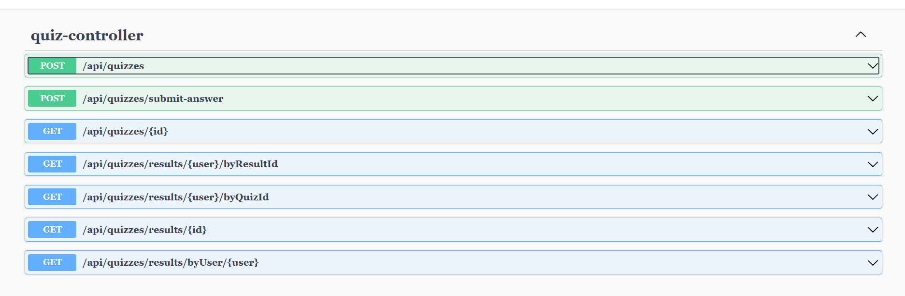

# Quiz Application

**Overview**

This is a Spring Boot-based quiz application that allows users to take quizzes and track their scores. Users can retake a quiz to improve their score. Quizzes are not subject to any question limits.

**Prerequisites**

- Java 21+
- Spring Boot 3+ 
- Gradle 8+
- H2DB (In-Memory database)

**Installation**

1. Clone the repository:
   ```bash
   git clone 
   
2. To unpack dependency and build with tests:
   ```bash
   gradle build
   
3. Run the application:
   ```bash
   gradle bootRun
   
4. Now application is running at port 8080

5. API doc is here http://localhost:8080/swagger-ui/index.html



**Note:**
<br>
H2DB is an in-memory database and will lose data upon application restart. Consider using a persistent database for production environments.

**Improvements can be done:**
<br>
API Authentication & Authorization
Junit test case

_____________
